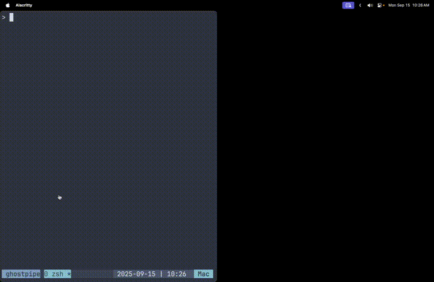

# Ghostpipe Excalidraw

Excalidraw with [Ghostpipe](https://github.com/inputlogic/ghostpipe) support.



## Setup

```bash
npm install
npm run dev
```

## Usage

`ghostpipe http://localhost:5173`

Then enter the file name where you want your drawing to be saved.

Open http://localhost:5173

